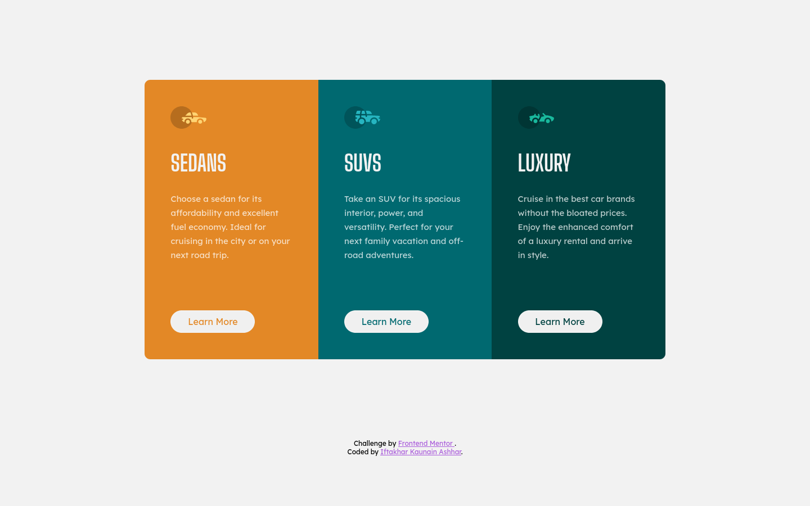

# Frontend Mentor - 3-column preview card component solution

This is a solution to the [3-column preview card component challenge on Frontend Mentor](https://www.frontendmentor.io/challenges/3column-preview-card-component-pH92eAR2-). Frontend Mentor challenges help you improve your coding skills by building realistic projects.

## Table of contents

-   [Overview](#overview)
    -   [Screenshot](#screenshot)
    -   [Links](#links)
-   [My process](#my-process)
    -   [Built with](#built-with)
-   [Author](#author)

## Overview

### Screenshots

### Links

-[Solution URL](https://github.com/iftkhr/column-preview-card)

-[Live Site URL](https://iftkhr.github.io/column-preview-card)

## My process

### Built with

-   Semantic HTML5 markup
-   CSS custom properties
-   CSS Grid
-   Mobile-first workflow

## Author

-   Website - [Iftakhar Kaunain Ashhar](https://iftkhr.github.io/)
-   Frontend Mentor - [@iftkhr](https://www.frontendmentor.io/profile/iftkhr)
